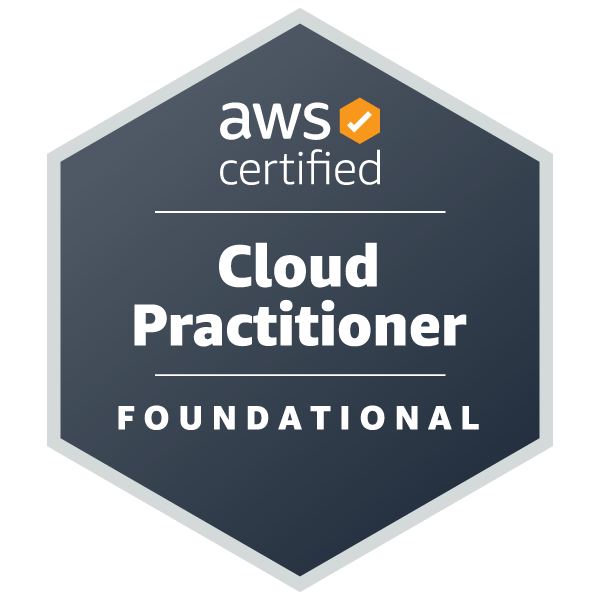

  

<h1 align="center">Hi, I'm Darshan Wagh 👋</h1>

  <b>Cloud & Software Engineer | AWS | DevOps | Cloud Automation</b>

  Software Developer passionate about building scalable cloud solutions,
   
  automating deployments, and developing reliable software systems.
    
  <b>Currently focused on AWS, Cloud Infrastructure, DevOps, CI/CD, Automation & Cloud-based AI.</b>

  

---

<h2 align="center">☁️ Cloud & DevOps</h2>

  
  &nbsp;&nbsp;
  
  &nbsp;&nbsp;
  
  &nbsp;&nbsp;
  
  &nbsp;&nbsp;
  

  <b>AWS</b> • <b>Azure</b> • <b>GCP</b> • <b>CI/CD</b> • <b>GitHub Actions</b> • <b>Cloud Deployment</b> • <b>Automation</b>

---

<h2 align="center">🚀 Technologies I Work With</h2>

<h3 align="center">☁️ Cloud & Infrastructure</h3>

  
  &nbsp;&nbsp;
  
  &nbsp;&nbsp;
  

  AWS EC2 • S3 • RDS • Cognito • Amplify • Azure • GCP

<h3 align="center">⚙️ DevOps & Automation</h3>

  GitHub Actions • CI/CD • Deployment Automation • Version Control • Cloud Workflows

<h3 align="center">💻 Programming & Data</h3>

  
  &nbsp;&nbsp;
  
  &nbsp;&nbsp;
  
  &nbsp;&nbsp;
  

  Python • JavaScript • SQL • MySQL • REST APIs • Backend Development

---

<h2 align="center">🏆 Certifications</h2>

  
  &nbsp;&nbsp;&nbsp;&nbsp;&nbsp;&nbsp;
  
  &nbsp;&nbsp;&nbsp;&nbsp;&nbsp;&nbsp;
  

  <b>AWS Certified Cloud Practitioner</b>
  &nbsp;&nbsp;•&nbsp;&nbsp;
  <b>AWS Certified AI Practitioner</b>
  &nbsp;&nbsp;•&nbsp;&nbsp;
  <b>GitHub Foundations</b>

---

<h2 align="center">📌 Currently Exploring</h2>

  ☁️ Cloud Architecture
  &nbsp; • &nbsp;
  ⚙️ DevOps & CI/CD
  &nbsp; • &nbsp;
  🔐 Cloud Security
    
  🤖 AI on Cloud
  &nbsp; • &nbsp;
  🏗️ Infrastructure Automation
  &nbsp; • &nbsp;
  📊 Cloud Data Systems

---

<h2 align="center">📂 Featured Work</h2>

  ☁️ Cloud Applications
  &nbsp; • &nbsp;
  ⚙️ CI/CD Automation
  &nbsp; • &nbsp;
  🤖 AI & Data Systems
  &nbsp; • &nbsp;
  🔧 Software Engineering

---

<h2 align="center">📊 GitHub Stats</h2>

  
  &nbsp;&nbsp;
  

---

<h2 align="center">📫 Connect With Me</h2>

  
  &nbsp;&nbsp;&nbsp;&nbsp;
  

  <i>Building with the cloud. Automating what can be automated. Learning what comes next. ☁️</i>

